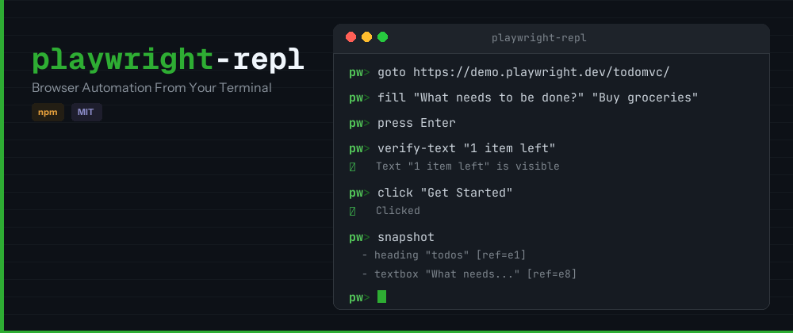
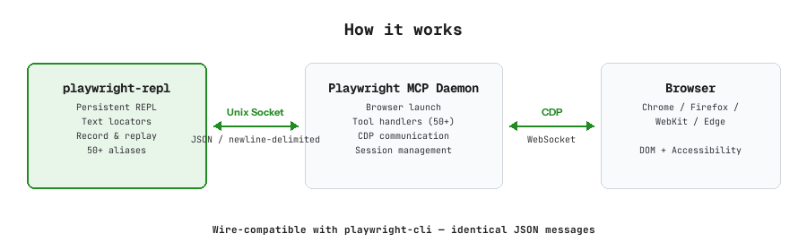

# playwright-repl



Interactive REPL for Playwright browser automation — keyword-driven testing from your terminal.

Inspired by [playwright-cli](https://github.com/anthropics/playwright-cli), reusing its command vocabulary and Playwright MCP daemon. Where playwright-cli is designed for AI agents (one command per process), playwright-repl is designed for **humans** — a persistent session with recording, replay, and instant feedback.

## Why?

The `playwright-cli` tool spawns a new Node.js process **per command** — connecting to the daemon, sending one message, and exiting. That's ~50–100ms overhead each time.

**playwright-repl** keeps a persistent socket connection open. Type a command, see the result instantly. Record your session, replay it later — no code, no tokens, no setup.

Key features beyond playwright-cli:
- **Text locators** — use `click "Submit"` or `fill "Email" "test@example.com"` instead of element refs. Auto-resolves via getByText, getByLabel, getByPlaceholder, and getByRole with fallback chains
- **Element refs** — also supports ref-based commands (`click e5`, `fill e7 "hello"`) from `snapshot` output
- **Assertions** — `verify-text`, `verify-element`, `verify-value`, `verify-list` for inline validation
- **Record & replay** — capture sessions as `.pw` files and replay them headlessly or step-by-step

```
pw> goto https://demo.playwright.dev/todomvc/
pw> fill "What needs to be done?" "Buy groceries"
pw> press Enter
pw> fill "What needs to be done?" "Write tests"
pw> press Enter
pw> check "Buy groceries"
pw> verify-text "1 item left"
```

Record it, replay it later:

```bash
pw> .record smoke-test
⏺ Recording to smoke-test.pw

pw> goto https://demo.playwright.dev/todomvc/
pw> fill "What needs to be done?" "Buy groceries"
pw> press Enter
pw> verify-text "1 item left"
pw> .save
✓ Saved 4 commands to smoke-test.pw

# Replay any time
$ playwright-repl --replay smoke-test.pw
```

## Install

```bash
npm install -g playwright-repl

# If you don't have browser binaries yet
npx playwright install

# Or install from source
git clone https://github.com/stevez/playwright-repl.git
cd playwright-repl && npm install && npm link
```

## Quick Start

```bash
# Start the REPL (launches browser automatically)
playwright-repl

# With a visible browser
playwright-repl --headed

# With a specific browser
playwright-repl --headed --browser firefox
```

Once inside the REPL, use either **text locators** or **element refs**:

```
pw> goto https://demo.playwright.dev/todomvc/

# Text locators — no snapshot needed
pw> fill "What needs to be done?" "Buy groceries"
pw> press Enter
pw> check "Buy groceries"
pw> verify-text "0 items left"

# Or use element refs from snapshot
pw> snapshot
- textbox "What needs to be done?" [ref=e8]
- listitem "Buy groceries" [ref=e21]

pw> click e21                      # click by ref
pw> screenshot                     # take a screenshot
pw> close                          # close browser
```

## Usage

```bash
# Interactive REPL
playwright-repl [options]

# Replay a recorded session
playwright-repl --replay session.pw

# Step through replay (pause between commands)
playwright-repl --replay session.pw --step

# Start REPL with recording enabled
playwright-repl --record my-test.pw

# Pipe commands
echo -e "goto https://example.com\nsnapshot" | playwright-repl

# Named sessions
playwright-repl --session checkout-flow --headed
```

### CLI Options

| Option | Description |
|--------|-------------|
| `-s, --session <name>` | Session name (default: `"default"`) |
| `-b, --browser <type>` | Browser: `chrome`, `firefox`, `webkit`, `msedge` |
| `--headed` | Run browser in headed (visible) mode |
| `--persistent` | Use persistent browser profile |
| `--profile <dir>` | Persistent profile directory |
| `--config <file>` | Path to config file |
| `--replay <file>` | Replay a `.pw` session file |
| `--record <file>` | Start REPL with recording to file |
| `--step` | Pause between commands during replay |
| `-q, --silent` | Suppress banner and status messages |
| `-h, --help` | Show help |

## Commands

### Navigation

| Command | Alias | Description |
|---------|-------|-------------|
| `goto <url>` | `g` | Navigate to a URL |
| `open [url]` | `o` | Open browser (optionally navigate) |
| `go-back` | `back` | Go back in history |
| `go-forward` | `fwd` | Go forward in history |
| `reload` | `r` | Reload page |

### Interaction

| Command | Alias | Description |
|---------|-------|-------------|
| `click <ref>` | `c` | Click an element |
| `dblclick <ref>` | `dc` | Double-click an element |
| `fill <ref> <text>` | `f` | Fill a form field |
| `type <text>` | `t` | Type text key by key |
| `press <key>` | `p` | Press a keyboard key |
| `hover <ref>` | `h` | Hover over element |
| `select <ref> <value>` | `sel` | Select dropdown option |
| `check <ref>` | `chk` | Check a checkbox |
| `uncheck <ref>` | `unchk` | Uncheck a checkbox |
| `upload <ref> <file>` | — | Upload a file |
| `drag <from> <to>` | — | Drag and drop |

### Inspection

| Command | Alias | Description |
|---------|-------|-------------|
| `snapshot` | `s` | Accessibility tree with element refs |
| `screenshot` | `ss` | Take a screenshot |
| `eval <expr>` | `e` | Evaluate JavaScript |
| `console` | `con` | Browser console messages |
| `network` | `net` | Network requests log |
| `run-code <code>` | — | Run Playwright code directly |

### Assertions

| Command | Alias | Description |
|---------|-------|-------------|
| `verify-text <text>` | `vt` | Verify text is visible on page |
| `verify-element <role> <name>` | `ve` | Verify element exists by role and name |
| `verify-value <ref> <value>` | `vv` | Verify input/select/checkbox value |
| `verify-list <ref> <items>` | `vl` | Verify list contains expected items |

### Tabs

| Command | Alias | Description |
|---------|-------|-------------|
| `tab-list` | `tl` | List open tabs |
| `tab-new [url]` | `tn` | Open a new tab |
| `tab-close [index]` | `tc` | Close a tab |
| `tab-select <index>` | `ts` | Switch to a tab |

### Storage & Cookies

| Command | Description |
|---------|-------------|
| `state-save [file]` | Save auth state (cookies + storage) |
| `state-load <file>` | Load auth state |
| `cookie-list` | List all cookies |
| `cookie-get <name>` | Get a specific cookie |
| `cookie-set <name> <value>` | Set a cookie |
| `cookie-delete <name>` | Delete a cookie |
| `cookie-clear` | Clear all cookies |
| `localstorage-list` | List all localStorage |
| `localstorage-get <key>` | Get localStorage value |
| `localstorage-set <key> <value>` | Set localStorage value |
| `localstorage-delete <key>` | Delete localStorage key |
| `localstorage-clear` | Clear all localStorage |
| `sessionstorage-list` | List all sessionStorage |
| `sessionstorage-get <key>` | Get sessionStorage value |
| `sessionstorage-set <key> <value>` | Set sessionStorage value |
| `sessionstorage-delete <key>` | Delete sessionStorage key |
| `sessionstorage-clear` | Clear all sessionStorage |

### Network Routing

| Command | Description |
|---------|-------------|
| `route <pattern>` | Intercept network requests |
| `route-list` | List active routes |
| `unroute [pattern]` | Remove route(s) |

### Dialogs & Layout

| Command | Description |
|---------|-------------|
| `dialog-accept [text]` | Accept a browser dialog |
| `dialog-dismiss` | Dismiss a browser dialog |
| `resize <w> <h>` | Resize browser window |
| `pdf` | Save page as PDF |

### Session Management

| Command | Alias | Description |
|---------|-------|-------------|
| `list` | `ls` | List active sessions |
| `close` | `q` | Close the browser |
| `close-all` | — | Close all sessions |
| `kill-all` | — | Kill all daemon processes |
| `config-print` | — | Print daemon config |
| `install-browser` | — | Install browser binaries |

### REPL Meta-Commands

| Command | Description |
|---------|-------------|
| `.help` | Show available commands |
| `.aliases` | Show all command aliases |
| `.status` | Show connection status |
| `.reconnect` | Reconnect to daemon |
| `.record [file]` | Start recording commands |
| `.save` | Stop recording and save to file |
| `.pause` | Pause/resume recording |
| `.discard` | Discard current recording |
| `.replay <file>` | Replay a recorded session |
| `.exit` | Exit REPL (also Ctrl+D) |

## Session Recording & Replay

Record your browser interactions and replay them later — great for regression tests, onboarding demos, or sharing reproducible flows.

### Record

```bash
# From CLI
playwright-repl --record my-test.pw --headed

# Or inside the REPL
pw> .record my-test
⏺ Recording to my-test.pw
pw> goto https://demo.playwright.dev/todomvc/
pw> fill "What needs to be done?" "Buy groceries"
pw> press Enter
pw> verify-text "1 item left"
pw> .save
✓ Saved 4 commands to my-test.pw
```

### Replay

```bash
# Full speed
playwright-repl --replay my-test.pw

# Step-through (press Enter between commands)
playwright-repl --replay my-test.pw --step --headed

# Or inside the REPL
pw> .replay my-test.pw
```

### File Format

`.pw` files are plain text — human-readable, diffable, version-controllable:

```
# CI smoke test — quick add-and-verify
# App: https://demo.playwright.dev/todomvc/

goto https://demo.playwright.dev/todomvc/
fill "What needs to be done?" "Buy groceries"
press Enter
verify-text "Buy groceries"
verify-text "1 item left"
```

### Recording Controls

| Command | Description |
|---------|-------------|
| `.record [file]` | Start recording |
| `.pause` | Pause recording (toggle) |
| `.save` | Stop and save to file |
| `.discard` | Discard without saving |

## Examples

All examples use the [TodoMVC demo](https://demo.playwright.dev/todomvc/) and can be run directly:

| File | Description |
|------|-------------|
| [01-add-todos.pw](examples/01-add-todos.pw) | Add todos and verify with assertions |
| [02-complete-and-filter.pw](examples/02-complete-and-filter.pw) | Complete todos, use filters |
| [03-record-session.pw](examples/03-record-session.pw) | Record a test session |
| [04-replay-session.pw](examples/04-replay-session.pw) | Replay with step-through |
| [05-ci-pipe.pw](examples/05-ci-pipe.pw) | CI smoke test |
| [06-edit-todo.pw](examples/06-edit-todo.pw) | Double-click to edit a todo |

Try one:

```bash
# Run an example with a visible browser
playwright-repl --replay examples/01-add-todos.pw --headed

# Step through an example interactively
playwright-repl --replay examples/04-replay-session.pw --step --headed

# Run as a CI smoke test (headless, silent)
playwright-repl --replay examples/05-ci-pipe.pw --silent
```

## Architecture



The REPL replaces only the **client half** of playwright-cli. The daemon, browser, and all tool handlers are unchanged — both CLI and REPL produce identical wire messages.

### How It Works

1. **Startup**: The REPL starts the Playwright daemon (if not already running) and connects via Unix socket / Windows named pipe
2. **Input**: User types a command like `click e5`
3. **Parse**: Alias resolution (`c` → `click`) + minimist parsing → `{ _: ["click", "e5"] }`
4. **Send**: JSON message over socket to the daemon
5. **Execute**: Daemon maps the command to a Playwright API call and executes it
6. **Result**: Response rendered in the terminal

### Socket Path

The daemon socket includes a hash of the workspace directory:

```
Linux/macOS:  /tmp/playwright-cli/{hash}/{session}.sock
Windows:      \\.\pipe\{hash}-{session}.sock
```

Both REPL and daemon hash the same `package.json` path, so they always find each other.

## Requirements

- **Node.js** >= 18
- **playwright** >= 1.59.0-alpha (includes `lib/mcp/terminal/` daemon)

## License

MIT
